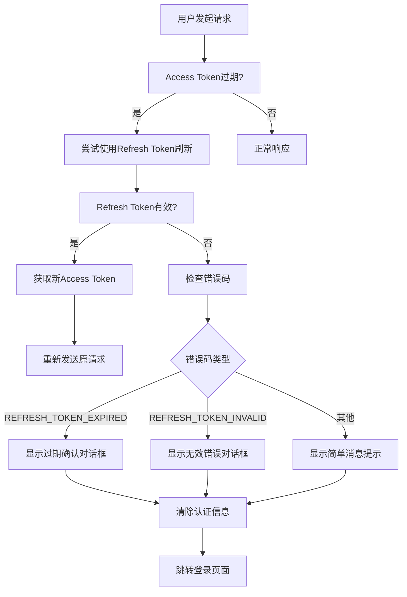

# 前端 Refresh Token 过期处理实现

## 🎯 功能概述

前端实现了完整的refresh token过期处理机制，包括三种不同类型的用户提示方式，确保用户在token过期时获得友好的用户体验。

## 📁 文件结构

```
frontend/src/
├── main.js                    # axios拦截器配置
├── utils/
│   └── auth-handler.js       # 认证处理工具类
└── components/
    └── AuthDemo.vue          # 演示组件
```

## 🔧 核心实现

### 1. 认证处理工具类 (`auth-handler.js`)

```javascript
import { ElMessage, ElMessageBox } from 'element-plus'
import router from '@/router'

export class AuthHandler {
  // 清除所有认证信息
  static clearAuthData() { /* ... */ }
  
  // 处理refresh token过期 - 显示确认对话框
  static async handleRefreshTokenExpired() { /* ... */ }
  
  // 处理refresh token无效 - 显示错误对话框  
  static async handleRefreshTokenInvalid(message) { /* ... */ }
  
  // 显示简单的token过期提示消息
  static showTokenExpiredMessage() { /* ... */ }
  
  // 处理其他认证错误
  static handleAuthError(error) { /* ... */ }
}
```

### 2. axios响应拦截器 (`main.js`)

```javascript
axios.interceptors.response.use(
  (response) => response,
  async (error) => {
    const originalRequest = error.config;
    
    if (error.response?.status === 401 && !originalRequest._retry) {
      // 尝试刷新token
      try {
        const refresh_token = localStorage.getItem("refresh_token");
        if (refresh_token) {
          const res = await axios.post("/api/auth/refresh", {}, {
            headers: { Authorization: "Bearer " + refresh_token },
          });
          // 刷新成功，重新发送原请求
          return axios(originalRequest);
        }
      } catch (e) {
        // 根据不同错误码显示不同的提示
        const errorCode = e.response?.data?.error_code;
        
        if (errorCode === 'REFRESH_TOKEN_EXPIRED') {
          AuthHandler.handleRefreshTokenExpired();
        } else if (errorCode === 'REFRESH_TOKEN_INVALID') {
          AuthHandler.handleRefreshTokenInvalid(errorMessage);
        } else {
          AuthHandler.showTokenExpiredMessage();
        }
      }
    }
    
    return Promise.reject(error);
  }
);
```

## 🎨 三种弹框类型

### 1. Refresh Token 过期 - 确认对话框

**触发场景**: 后端返回 `REFRESH_TOKEN_EXPIRED` 错误码

**效果展示**:
```javascript
ElMessageBox.confirm(
  '您的登录已过期，为了保护您的账户安全，请重新登录。',
  '登录过期提醒',
  {
    confirmButtonText: '重新登录',
    cancelButtonText: '稍后再说',
    type: 'warning',
    showClose: false,
    closeOnClickModal: false,
    closeOnPressEscape: false
  }
)
```

**特点**:
- ⚠️ 警告图标，友好提醒
- 🔒 无法通过ESC或点击遮罩关闭
- 🔄 即使点击"稍后再说"也会强制跳转
- ⏰ 给用户2秒时间查看提示信息

### 2. Token 无效 - 错误对话框

**触发场景**: 后端返回 `REFRESH_TOKEN_INVALID` 或 `REFRESH_TOKEN_ERROR` 错误码

**效果展示**:
```javascript
ElMessageBox.alert(
  '登录信息无效，请重新登录以继续使用系统。',
  '登录失效',
  {
    confirmButtonText: '立即登录',
    type: 'error',
    showClose: false,
    closeOnClickModal: false,
    closeOnPressEscape: false
  }
)
```

**特点**:
- ❌ 错误图标，表示严重问题
- 🚫 只有确认按钮，必须处理
- 📝 可显示后端返回的具体错误信息
- 🔒 无法绕过，必须确认

### 3. 简单消息提示

**触发场景**: 其他token相关错误或没有refresh token

**效果展示**:
```javascript
ElMessage({
  type: 'warning',
  message: '登录已过期，正在跳转到登录页面...',
  duration: 2000,
  showClose: true,
  onClose: () => {
    // 清理并跳转
  }
})
```

**特点**:
- 💡 简洁的消息提示
- ⏱️ 2秒自动消失
- ❌ 可手动关闭
- 🏃‍♂️ 不阻塞用户操作

## 🎮 使用演示

可以通过 `AuthDemo.vue` 组件测试不同场景：

```vue
<template>
  <el-button @click="simulateRefreshTokenExpired">
    模拟 Refresh Token 过期
  </el-button>
  <el-button @click="simulateRefreshTokenInvalid">  
    模拟 Token 无效
  </el-button>
  <el-button @click="simulateTokenExpired">
    模拟 Token 过期提示
  </el-button>
</template>
```

## 🔄 完整处理流程



## 🛡️ 安全特性

1. **强制清理**: 所有场景都会清除本地认证信息
2. **无法绕过**: 关键对话框无法通过ESC或点击遮罩关闭
3. **自动跳转**: 确保最终都会跳转到登录页面
4. **状态同步**: 自动清除用户store中的状态信息

## 🎯 用户体验优化

1. **分级提示**: 不同错误使用不同图标和颜色
2. **友好文案**: 使用易懂的提示文字
3. **渐进处理**: 给用户时间理解提示信息
4. **无感刷新**: 成功刷新时用户无感知
5. **状态反馈**: 加载状态和进度提示

## 📱 响应式支持

所有对话框都支持移动端适配：
- 自动调整大小和位置
- 触摸友好的按钮尺寸
- 适配小屏幕的文字大小

## 🔧 自定义配置

可以通过修改 `AuthHandler` 类来自定义：
- 提示文案内容
- 对话框样式
- 跳转延迟时间
- 清理的存储项目

这个实现确保了在各种token过期场景下，用户都能获得清晰、友好的提示，并被安全地引导到登录页面重新认证。