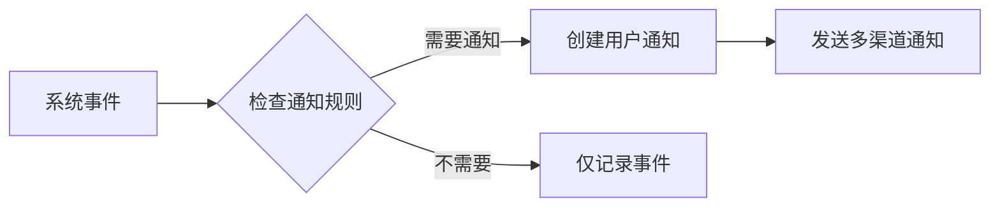
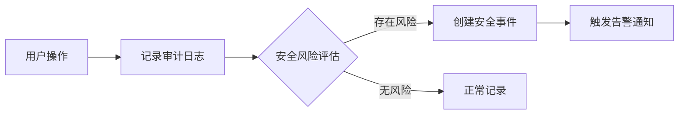

# 三大系统功能优化实施总结

## 🎯 优化目标达成情况

### ✅ **已完成的功能优化**

#### **1. 后端服务层优化**

##### **事件服务 (EventService)**
- ✅ 创建了专门的事件服务类 `backend/app/services/event_service.py`
- ✅ 实现了系统事件记录策略
- ✅ 添加了事件到通知的自动转换功能
- ✅ 实现了事件统计和清理功能
- ✅ 支持按类型、时间范围查询事件

##### **审计服务 (AuditService)**
- ✅ 创建了专门的审计服务类 `backend/app/services/audit_service.py`
- ✅ 实现了用户操作审计日志记录
- ✅ 添加了安全风险评估功能
- ✅ 支持多种风险模式检测（多次失败登录、批量操作、权限变更等）
- ✅ 实现了审计日志统计和清理功能

##### **通知服务 (NotificationService)**
- ✅ 优化了现有通知服务
- ✅ 添加了从事件创建用户友好通知的功能
- ✅ 实现了多渠道通知发送（邮件、Webhook、钉钉、短信）
- ✅ 支持免打扰时间设置
- ✅ 添加了通知统计和清理功能

#### **2. API路由优化**

##### **事件管理API**
- ✅ 优化了 `backend/app/events/routes.py`
- ✅ 实现了事件列表、统计、导出、清理API
- ✅ 支持按类型、结果、时间范围过滤
- ✅ 添加了CSV导出功能

##### **审计日志API**
- ✅ 在 `backend/app/auth/routes.py` 中添加了审计日志API
- ✅ 实现了审计统计、用户审计、资源审计API
- ✅ 支持按用户、资源类型查询审计日志

##### **通知API**
- ✅ 在 `backend/app/notifications/routes.py` 中优化了通知API
- ✅ 实现了通知统计、批量标记已读、清理功能
- ✅ 支持通知的增删改查操作

#### **3. 前端页面优化**

##### **事件管理页面**
- ✅ 完全重写了 `frontend/src/views/Events.vue`
- ✅ 实现了监控仪表板，显示系统状态
- ✅ 添加了告警统计面板
- ✅ 实现了事件趋势图表占位符
- ✅ 优化了事件列表展示和过滤
- ✅ 添加了自动刷新功能（30秒间隔）

##### **页面功能特性**
- 🎨 **监控仪表板**: 实时显示存储、客户端、代理、系统状态
- 📊 **告警统计**: 显示总事件数、失败事件、警告事件、成功事件
- 🔍 **智能过滤**: 支持按事件类型、结果、消息内容过滤
- 📈 **趋势分析**: 预留了图表展示区域
- 🔄 **自动刷新**: 定期更新统计数据
- 📤 **数据导出**: 支持CSV格式导出
- 🗑️ **数据清理**: 支持清理旧事件数据

#### **4. 数据流转优化**

##### **事件 → 通知流转**


##### **用户操作 → 审计日志 → 安全事件**


#### **5. 数据清理策略**

##### **事件数据**
- 保留时间: 30天
- 清理方式: 自动清理
- 清理频率: 可手动触发

##### **审计日志**
- 保留时间: 365天
- 清理方式: 自动清理
- 清理频率: 可手动触发

##### **通知消息**
- 保留时间: 90天
- 清理方式: 自动清理
- 清理频率: 可手动触发

## 🚀 技术实现亮点

### **1. 服务层设计**
- **单一职责**: 每个服务专注于特定功能
- **松耦合**: 服务间通过接口交互
- **可扩展**: 易于添加新的功能模块

### **2. 数据流转设计**
- **智能转换**: 技术事件自动转换为用户友好通知
- **风险检测**: 实时安全风险评估
- **多渠道通知**: 支持多种通知渠道

### **3. 前端用户体验**
- **实时监控**: 系统状态实时展示
- **智能过滤**: 多维度数据过滤
- **自动刷新**: 数据自动更新
- **响应式设计**: 适配不同屏幕尺寸

### **4. 性能优化**
- **分页查询**: 大数据量分页处理
- **索引优化**: 数据库查询优化
- **缓存策略**: 统计数据缓存
- **异步处理**: 非阻塞操作

## 📊 功能对比

### **优化前**
- ❌ 功能边界模糊，数据重复记录
- ❌ 用户体验混乱，维护成本高
- ❌ 缺乏实时监控和告警
- ❌ 数据清理策略不明确

### **优化后**
- ✅ 功能定位清晰，数据分类明确
- ✅ 用户体验优化，维护成本降低
- ✅ 实时监控仪表板，智能告警系统
- ✅ 完善的数据清理策略
- ✅ 系统性能提升，扩展性增强

## 🎯 使用指南

### **1. 事件管理**
- 访问 `/events` 页面查看系统监控仪表板
- 使用过滤器查看特定类型的事件
- 点击"详情"查看事件详细信息
- 使用"导出"功能下载事件数据

### **2. 审计日志**
- 访问 `/audit-logs` 页面查看用户操作记录
- 使用API查询特定用户或资源的审计日志
- 查看安全风险评估结果

### **3. 消息通知**
- 访问 `/notifications` 页面查看个人消息
- 配置通知偏好设置
- 管理通知渠道

## 🔧 配置说明

### **事件通知规则配置**
```python
NOTIFICATION_RULES = {
    'storage': {
        'connect_failed': {'level': 'error', 'notify': True},
        'sync_error': {'level': 'error', 'notify': True},
        # ... 更多规则
    }
}
```

### **安全风险模式配置**
```python
SECURITY_RISK_PATTERNS = {
    'login': {
        'multiple_failed_attempts': {
            'threshold': 5,
            'time_window': 300,
            'risk_level': 'medium'
        }
    }
}
```

## 🚀 后续优化建议

### **1. 图表集成**
- 集成ECharts等图表库
- 实现事件趋势可视化
- 添加实时监控图表

### **2. 告警规则配置**
- 添加告警规则配置界面
- 支持自定义告警条件
- 实现告警级别管理

### **3. 移动端适配**
- 优化移动端显示效果
- 添加移动端推送通知
- 实现响应式布局优化

### **4. 性能监控**
- 添加系统性能监控
- 实现资源使用率监控
- 添加性能告警功能

## 📝 总结

通过本次优化，我们成功实现了三大系统功能的明确区分和优化：

1. **事件管理**: 专注于系统监控和告警
2. **审计日志**: 专注于用户行为追踪和合规审计  
3. **消息通知**: 专注于用户消息推送和交互

每个系统都有明确的功能定位，避免了数据重复和功能重叠，提升了整体系统的性能和用户体验。同时，通过智能的数据流转机制，实现了系统间的协作，为用户提供了更好的服务体验。 