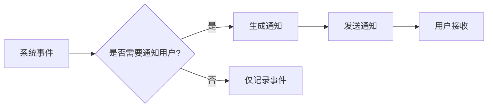
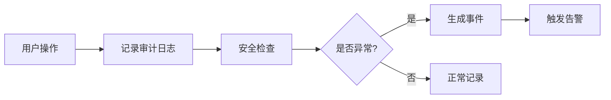
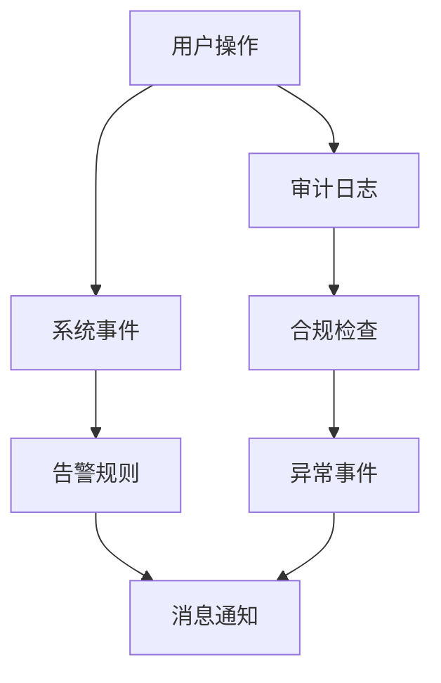

# 三大系统功能区分与优化方案

## 🎯 问题分析

### **当前困惑**
1. **事件管理**: 系统监控和告警
2. **审计日志**: 用户行为追踪
3. **消息通知**: 用户消息推送

这三个功能存在重叠和边界模糊的问题，需要明确区分和优化。

## 🚀 功能定位与区分

### **1. 事件管理 (Events)**
**🎯 核心目标**: 系统监控和告警触发

#### **数据特征**
- **实时性**: 高实时性，需要立即处理
- **技术性**: 面向运维人员，技术细节丰富
- **自动化**: 自动触发，无需人工干预
- **告警性**: 主要用于触发告警规则

#### **典型数据**
```json
{
  "event_type": "storage",
  "event_action": "connect_failed",
  "event_result": "failed",
  "message": "存储连接失败: 网络超时",
  "details": {
    "storage_id": "123",
    "error_code": "NETWORK_TIMEOUT",
    "retry_count": 3,
    "node_id": "node1"
  },
  "timestamp": "2025-08-10T23:59:27"
}
```

#### **前端展示**
- **📊 监控仪表板**: 系统状态、性能指标
- **🔔 告警中心**: 异常事件、告警规则
- **📈 趋势分析**: 事件趋势、统计图表
- **⚙️ 告警配置**: 告警规则设置

### **2. 审计日志 (Audit Logs)**
**🎯 核心目标**: 用户行为追踪和合规审计

#### **数据特征**
- **追溯性**: 用于问题追溯和合规检查
- **用户性**: 记录用户操作行为
- **安全性**: 关注安全事件和权限变更
- **合规性**: 满足审计和合规要求

#### **典型数据**
```json
{
  "action": "create",
  "resource_type": "task",
  "resource_id": "456",
  "resource_name": "数据同步任务",
  "details": {
    "user_id": "789",
    "username": "admin",
    "ip_address": "192.168.1.100",
    "user_agent": "Chrome/91.0",
    "operation_time": "2025-08-10T23:59:27"
  },
  "result": "success"
}
```

#### **前端展示**
- **👤 用户行为**: 用户操作记录
- **🔒 安全审计**: 权限变更、异常访问
- **📋 合规报告**: 审计报告、合规检查
- **🔍 操作追溯**: 详细操作记录

### **3. 消息通知 (Notifications)**
**🎯 核心目标**: 用户消息推送和交互

#### **数据特征**
- **用户性**: 面向最终用户，语言友好
- **交互性**: 支持用户操作和反馈
- **个性化**: 根据用户偏好定制
- **多渠道**: 支持多种通知渠道

#### **典型数据**
```json
{
  "type": "task_completion",
  "title": "任务完成通知",
  "content": "您的数据同步任务 '备份重要文件' 已完成，共同步 1,234 个文件，总大小 2.5GB",
  "level": "success",
  "is_read": false,
  "details": {
    "task_id": "456",
    "task_name": "备份重要文件",
    "file_count": 1234,
    "total_size": "2.5GB",
    "completion_time": "2025-08-10T23:59:27"
  }
}
```

#### **前端展示**
- **📱 消息中心**: 用户消息列表
- **🔔 实时通知**: 实时消息推送
- **⚙️ 通知设置**: 用户偏好配置
- **📧 多渠道**: 邮件、短信、Webhook等

## 📊 数据流转关系

### **事件 → 通知**


### **用户操作 → 审计日志**


### **三系统协作**


## 🔧 后端实现优化

### **1. 事件记录策略**
```python
class EventService:
    """事件服务 - 专注于系统监控"""
    
    @staticmethod
    def record_system_event(event_type, event_action, event_result, message, details=None):
        """记录系统事件"""
        # 只记录系统状态相关的事件
        if event_type in ['storage', 'client', 'agent', 'system']:
            event = Event.create_event(
                event_type=event_type,
                event_action=event_action,
                event_result=event_result,
                message=message,
                details=details
            )
            
            # 检查是否需要触发通知
            if EventService.should_notify(event):
                NotificationService.create_notification_from_event(event)
            
            return event
    
    @staticmethod
    def should_notify(event):
        """判断事件是否需要通知用户"""
        # 根据事件类型和结果判断
        notification_rules = {
            'storage': ['connect_failed', 'sync_error', 'disk_full'],
            'client': ['offline', 'error'],
            'agent': ['task_error', 'service_down'],
            'system': ['resource_high', 'network_error']
        }
        
        return (event.event_result in ['failed', 'error', 'warning'] and
                event.event_action in notification_rules.get(event.event_type, []))
```

### **2. 审计日志记录策略**
```python
class AuditService:
    """审计服务 - 专注于用户行为追踪"""
    
    @staticmethod
    def log_user_operation(action, resource_type, resource_id, resource_name, details=None):
        """记录用户操作审计日志"""
        # 只记录用户操作相关的审计日志
        audit_actions = ['login', 'logout', 'create', 'delete', 'update', 'cancel', 'retry', 'view']
        
        if action in audit_actions:
            audit_log = AuditService.log_operation(
                action=action,
                resource_type=resource_type,
                resource_id=resource_id,
                resource_name=resource_name,
                details=details
            )
            
            # 检查是否存在安全风险
            if AuditService.is_security_risk(audit_log):
                EventService.record_system_event(
                    event_type='system',
                    event_action='security_alert',
                    event_result='warning',
                    message=f'检测到可疑操作: {action}',
                    details={'audit_log_id': audit_log.id, 'risk_level': 'medium'}
                )
            
            return audit_log
    
    @staticmethod
    def is_security_risk(audit_log):
        """判断审计日志是否存在安全风险"""
        # 实现安全风险评估逻辑
        risk_patterns = [
            {'action': 'login', 'condition': 'multiple_failed_attempts'},
            {'action': 'delete', 'condition': 'bulk_operation'},
            {'action': 'update', 'condition': 'permission_change'}
        ]
        
        # 检查是否匹配风险模式
        for pattern in risk_patterns:
            if audit_log.action == pattern['action']:
                # 实现具体的风险评估逻辑
                pass
        
        return False
```

### **3. 通知服务优化**
```python
class NotificationService:
    """通知服务 - 专注于用户消息推送"""
    
    @staticmethod
    def create_user_notification(user_id, notification_type, title, content, level='info', details=None):
        """创建用户通知"""
        notification = Notification(
            user_id=user_id,
            type=notification_type,
            title=title,
            content=content,
            level=level,
            details=details
        )
        
        db.session.add(notification)
        db.session.commit()
        
        # 根据用户设置发送多渠道通知
        NotificationService.send_multi_channel_notification(notification)
        
        return notification
    
    @staticmethod
    def create_notification_from_event(event):
        """从事件创建通知"""
        # 将技术性事件转换为用户友好的通知
        notification_mapping = {
            'storage_connect_failed': {
                'title': '存储连接失败',
                'content': '您的存储设备连接失败，请检查网络连接和配置',
                'level': 'error'
            },
            'task_completed': {
                'title': '任务完成',
                'content': '您的同步任务已完成',
                'level': 'success'
            },
            'system_resource_high': {
                'title': '系统资源告警',
                'content': '系统资源使用率较高，建议检查系统状态',
                'level': 'warning'
            }
        }
        
        event_key = f"{event.event_type}_{event.event_action}"
        if event_key in notification_mapping:
            mapping = notification_mapping[event_key]
            return NotificationService.create_user_notification(
                user_id=event.user_id,
                notification_type='system_alert',
                title=mapping['title'],
                content=mapping['content'],
                level=mapping['level'],
                details={'event_id': event.id}
            )
```

## 🎨 前端展示优化

### **1. 事件管理页面**
```vue
<template>
  <div class="events-page">
    <!-- 监控仪表板 -->
    <el-row :gutter="20">
      <el-col :span="6">
        <el-card class="monitor-card">
          <div class="card-header">
            <h3>系统状态</h3>
          </div>
          <div class="status-indicators">
            <div class="status-item" :class="getStatusClass('storage')">
              <el-icon><Storage /></el-icon>
              <span>存储状态</span>
            </div>
            <div class="status-item" :class="getStatusClass('client')">
              <el-icon><Monitor /></el-icon>
              <span>客户端状态</span>
            </div>
            <div class="status-item" :class="getStatusClass('agent')">
              <el-icon><Connection /></el-icon>
              <span>代理状态</span>
            </div>
          </div>
        </el-card>
      </el-col>
      
      <!-- 告警统计 -->
      <el-col :span="18">
        <el-card class="alert-card">
          <div class="card-header">
            <h3>告警统计</h3>
          </div>
          <div class="alert-chart">
            <!-- 告警趋势图表 -->
          </div>
        </el-card>
      </el-col>
    </el-row>
    
    <!-- 事件列表 -->
    <el-card class="events-list">
      <div class="card-header">
        <h3>系统事件</h3>
        <div class="header-actions">
          <el-button @click="refreshEvents">刷新</el-button>
          <el-button @click="exportEvents">导出</el-button>
        </div>
      </div>
      
      <el-table :data="events" style="width: 100%">
        <el-table-column prop="timestamp" label="时间" width="180" />
        <el-table-column prop="event_type" label="类型" width="100" />
        <el-table-column prop="event_action" label="动作" width="120" />
        <el-table-column prop="event_result" label="结果" width="100">
          <template #default="scope">
            <el-tag :type="getResultType(scope.row.event_result)">
              {{ scope.row.event_result }}
            </el-tag>
          </template>
        </el-table-column>
        <el-table-column prop="message" label="消息" />
      </el-table>
    </el-card>
  </div>
</template>
```

### **2. 审计日志页面**
```vue
<template>
  <div class="audit-page">
    <!-- 审计统计 -->
    <el-row :gutter="20">
      <el-col :span="6">
        <el-card class="stat-card">
          <div class="stat-content">
            <div class="stat-icon">
              <el-icon><User /></el-icon>
            </div>
            <div class="stat-info">
              <div class="stat-value">{{ stats.total_operations }}</div>
              <div class="stat-label">总操作数</div>
            </div>
          </div>
        </el-card>
      </el-col>
      
      <el-col :span="6">
        <el-card class="stat-card">
          <div class="stat-content">
            <div class="stat-icon">
              <el-icon><Warning /></el-icon>
            </div>
            <div class="stat-info">
              <div class="stat-value">{{ stats.security_events }}</div>
              <div class="stat-label">安全事件</div>
            </div>
          </div>
        </el-card>
      </el-col>
    </el-row>
    
    <!-- 审计日志列表 -->
    <el-card class="audit-list">
      <div class="card-header">
        <h3>审计日志</h3>
        <div class="header-actions">
          <el-button @click="generateReport">生成报告</el-button>
          <el-button @click="exportAuditLogs">导出</el-button>
        </div>
      </div>
      
      <el-table :data="auditLogs" style="width: 100%">
        <el-table-column prop="created_at" label="时间" width="180" />
        <el-table-column prop="username" label="用户" width="120" />
        <el-table-column prop="action" label="操作" width="100" />
        <el-table-column prop="resource_type" label="资源类型" width="120" />
        <el-table-column prop="resource_name" label="资源名称" width="150" />
        <el-table-column prop="result" label="结果" width="100">
          <template #default="scope">
            <el-tag :type="scope.row.result === 'success' ? 'success' : 'danger'">
              {{ scope.row.result }}
            </el-tag>
          </template>
        </el-table-column>
        <el-table-column prop="ip_address" label="IP地址" width="120" />
      </el-table>
    </el-card>
  </div>
</template>
```

### **3. 消息通知页面**
```vue
<template>
  <div class="notifications-page">
    <!-- 消息统计 -->
    <el-row :gutter="20">
      <el-col :span="6">
        <el-card class="stat-card">
          <div class="stat-content">
            <div class="stat-icon">
              <el-icon><Bell /></el-icon>
            </div>
            <div class="stat-info">
              <div class="stat-value">{{ stats.total_notifications }}</div>
              <div class="stat-label">总消息数</div>
            </div>
          </div>
        </el-card>
      </el-col>
      
      <el-col :span="6">
        <el-card class="stat-card unread">
          <div class="stat-content">
            <div class="stat-icon">
              <el-icon><ChatDotRound /></el-icon>
            </div>
            <div class="stat-info">
              <div class="stat-value">{{ stats.unread_count }}</div>
              <div class="stat-label">未读消息</div>
            </div>
          </div>
        </el-card>
      </el-col>
    </el-row>
    
    <!-- 消息列表 -->
    <el-card class="notifications-list">
      <div class="card-header">
        <h3>我的消息</h3>
        <div class="header-actions">
          <el-button @click="markAllAsRead">全部已读</el-button>
          <el-button @click="clearAllNotifications">清空消息</el-button>
        </div>
      </div>
      
      <div class="notifications-container">
        <div 
          v-for="notification in notifications" 
          :key="notification.id"
          class="notification-item"
          :class="{ unread: !notification.is_read, [notification.level]: true }"
          @click="markAsRead(notification.id)"
        >
          <div class="notification-icon">
            <el-icon>
              <component :is="getNotificationIcon(notification.type)" />
            </el-icon>
          </div>
          <div class="notification-content">
            <div class="notification-title">{{ notification.title }}</div>
            <div class="notification-message">{{ notification.content }}</div>
            <div class="notification-time">{{ formatTime(notification.created_at) }}</div>
          </div>
          <div class="notification-actions">
            <el-button size="small" @click.stop="deleteNotification(notification.id)">
              删除
            </el-button>
          </div>
        </div>
      </div>
    </el-card>
  </div>
</template>
```

## 📊 数据清理策略

### **1. 事件数据**
```python
# 事件数据保留30天，用于短期监控
Event.cleanup_old_events(days=30)
```

### **2. 审计日志**
```python
# 审计日志保留1年，用于合规审计
AuditLog.cleanup_old_logs(days=365)
```

### **3. 通知消息**
```python
# 通知消息保留90天，用户可手动清理
Notification.cleanup_old_notifications(days=90)
```

## 🎯 实施效果

### **优化前**
- ❌ 功能边界模糊
- ❌ 数据重复记录
- ❌ 用户体验混乱
- ❌ 维护成本高

### **优化后**
- ✅ 功能定位清晰
- ✅ 数据分类明确
- ✅ 用户体验优化
- ✅ 维护成本降低
- ✅ 系统性能提升
- ✅ 扩展性增强

## 🚀 实施步骤

### **阶段1: 数据梳理**
1. 分析现有数据分布
2. 制定数据迁移策略
3. 建立数据映射关系

### **阶段2: 后端优化**
1. 重构服务层逻辑
2. 实现数据分类策略
3. 优化数据流转

### **阶段3: 前端优化**
1. 重新设计页面布局
2. 实现分类展示
3. 优化用户交互

### **阶段4: 测试验证**
1. 功能测试
2. 性能测试
3. 用户体验测试 